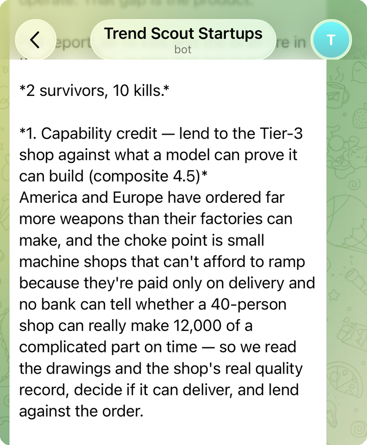

# Trend Scout

**An autonomous research agent that argues with its own past conclusions.**

Three mornings a week, unattended, it scans startups with real traction,
extracts the mechanism that makes them work, and looks for a buyer the
category leader is structurally locked out of serving. Then it tries to kill
what it just found — and re-opens verdicts it reached weeks ago when new
evidence contradicts them.

It has run **31 scheduled passes over 10 weeks**, produced **282 ideas**, and
**killed 260 of them (92.2%)**. The kill rate is the product. An idea
generator that likes its own output is worthless; the engineering problem
here was building something that reliably talks itself out of things.

```
scan traction → extract mechanism → narrow to a locked-out buyer
                                          ↓
                          adversarial kill check (3 tests)
                                          ↓
                    260 killed ←──────────┴──────────→ 22 survive
                                                             ↓
                                          re-audited on later runs
                                          against new evidence
                                                             ↓
                                       "SURVIVES, but novelty softening"
```

---

## The unusual part: the system audits its own back catalog

Most idea pipelines are write-only — they emit a verdict and move on. This one
returns to ideas it already blessed and re-litigates them against evidence that
didn't exist when it first ran.

A real example from the ledger, idea `ts-0054` (independent accumulation model
for correlated AI failures), first scored 4.3 and marked `watching` on
2026-06-25. Re-checked 2026-07-21:

> **SURVIVES but novelty softening.** Still no productized independent
> correlated-AI-failure accumulation model for primary carriers — so the product
> wedge remains open. BUT the thesis is now widely-published broker/academic
> copy: Gallagher Re "identifies systemic risk from AI model failures," Swiss Re
> sigma 07/2026, and arXiv papers…

That is the agent reporting that its own earlier conclusion is decaying, citing
sources published after it made the call, and *lowering its confidence without
being asked to*. Twelve ideas carry re-check records like this. Some
strengthened (`ts-0032` upgraded when the FY2026 defense budget created a
$13.4B standalone AI line); some softened; the point is that the verdict is
never final.

**The safety model that makes this sound.** An agent that revises its own
history is exactly the kind of thing that should worry you, so the write path
is deliberately narrow:

- **The model never commits.** The research step has *write-file* permission
  only. Committing, pushing, and notification are separate workflow steps the
  model does not control — so a confused run can produce a bad file, but it
  cannot rewrite history, force-push, or touch anything outside the repo.
- **Append-only reasoning.** Re-checks are *added* to a ledger entry as dated
  records. The original call and its score stay in the file. The agent can
  change its mind; it cannot quietly erase having been wrong.
- **Silence is a failure, not a success.** The commit step fails the build on
  an empty diff. A run that produces nothing gets flagged loudly instead of
  passing as a green check — the failure mode that actually bites unattended
  automation.
- **Blast radius sized to permissions.** This agent writes markdown into its
  own repo and nothing else, which is *why* it's allowed to commit straight to
  `main` with no PR gate. That posture is a consequence of what it can damage,
  not a default I apply everywhere.

---

## What it produced

| | |
|---|---|
| Scheduled runs completed | **31** (2026-06-16 → 2026-08-25) |
| Runs that failed to produce a report | **2** (July 4, Aug 27 — Claude quota exhausted; both failed loudly, neither committed) |
| Ideas evaluated | **282** |
| Killed | **260 (92.2%)** |
| Survived to `watching` / `new` | **22** |
| Full briefs written | **22** |
| Ideas re-audited on later runs | **12** |

<p align="center">
  
</p>

<p align="center"><em>Every run ends with a push notification — survivor count, kill
count, and each surviving idea explained in plain English. Representative output;
the full report and every kill reason land in the repo at the same time.</em></p>

Every kill is logged with its reason, which is the part that compounds: the
agent reads its own kill list before each run so it doesn't re-discover and
re-kill the same dead idea. A representative entry:

> `ts-0013` — **Why-now collapsed.** The May 2026 final rule scaled 1071 back:
> the covered-institution threshold was raised tenfold to 1,000 originations…

---

## Architecture

```
GitHub Actions cron (Tue/Thu/Sat 06:00 UTC)
        │
        ├── headless Claude Code  ← automation/trend_research_prompt.md
        │      reads:  ledger (all 282 prior verdicts), last 3 reports,
        │              rubric, watchlist
        │      writes: report + digest + ledger update + briefs
        │      (WRITE-FILE ONLY — reads the web, but cannot commit or push)
        │
        ├── commit & push          ← fails loudly on empty diff
        └── Telegram digest        ← separate step, secrets scoped here
```

**Design choices worth defending:**

- **The prompt is the program.** [`automation/trend_research_prompt.md`](automation/trend_research_prompt.md)
  is 207 lines of specification — ordered gates, named failure modes, explicit
  kill tests. The interesting engineering is in constraining a model's judgment,
  not in glue code. There is deliberately almost no application code.
- **JSON ledger over a database.** 282 entries don't need Postgres, and a
  diffable ledger means every verdict change shows up in `git log` as a
  reviewable line. The audit trail is free.
- **Markdown as the durable artifact.** Reports render on GitHub, diff cleanly,
  and stay readable with no runtime. Nothing here needs a server.

---

## Repo layout

| Path | What it is |
|---|---|
| [`automation/trend_research_prompt.md`](automation/trend_research_prompt.md) | **The core.** The full research specification. |
| [`.github/workflows/trend-scout.yml`](.github/workflows/trend-scout.yml) | Cron, step separation, empty-diff guard. |
| [`scoring/rubric.md`](scoring/rubric.md) | Hard gates + scoring dimensions. |
| [`sources/watchlist.md`](sources/watchlist.md) | Where it looks, and why traction sources lead. |
| [`ideas/ledger.json`](ideas/ledger.json) | All 282 verdicts, kill reasons, re-checks. |
| [`ideas/briefs/`](ideas/briefs/) | 22 full write-ups for ideas that cleared the brief threshold. |
| [`reports/2026/`](reports/2026/) | One report per run — the durable archive. |

---

## Running it

**Honest status: this repo is the agent's specification and its complete
output archive. It is not a library you `pip install`.**

*What runs standalone:*

```bash
# Requires: Claude Code CLI + an authenticated Claude subscription.
claude -p "$(cat automation/trend_research_prompt.md)" --model opus
```

Executed from a clone, this performs a real research pass and writes a report,
a digest, and ledger updates into your working tree. This is the whole system —
there is no hidden service.

*What needs infrastructure you'd have to supply:*

- **The schedule** needs a GitHub repo with Actions enabled and a
  `CLAUDE_CODE_OAUTH_TOKEN` secret (`claude setup-token`).
- **Telegram digests** need `TELEGRAM_BOT_TOKEN` and `TELEGRAM_CHAT_ID`. Without
  them the research still runs; only the notification step is skipped.
- **Local manual runs** read those two from `~/.config/trend-scout/secrets.env`.

No secrets are stored in this repository, and none ever have been —
[`automation/telegram_digest.sh`](automation/telegram_digest.sh) sources them
from outside the tree, and the workflow reads them from Actions secrets.

## License

MIT — see [LICENSE](LICENSE).
